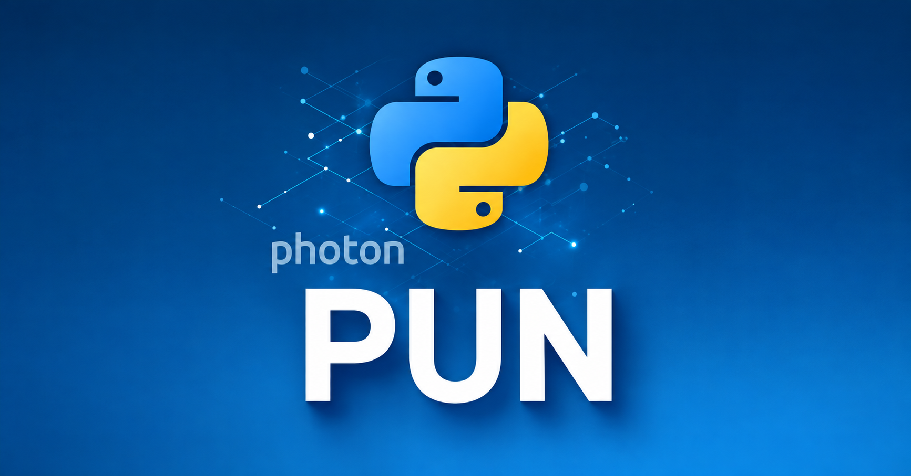

# Photon PUN2 Python

> Made by **Pupsik** and **Arcuma Hacks** · 📱 [t.me/ModsGays](https://t.me/ModsGays)

[](https://python.org)
[](LICENSE)
[](https://www.photonengine.com/pun)

A Python implementation of **Photon Unity Networking 2 (PUN2)** — the popular multiplayer networking library originally designed for Unity. This library allows Python applications to connect to Photon servers, join rooms, synchronize game objects, and call RPCs, fully compatible with PUN2 Unity clients.

---

## ✨ Features

- 🔌 **Full PUN2 protocol support** — connects to Photon Cloud as a PUN2 client
- 🏠 **Room management** — create, join, list rooms
- 🧩 **PhotonView & Instantiate** — spawn and sync game objects
- 📡 **RPC (Remote Procedure Calls)** — call methods on remote clients
- 🔄 **Delta compression** — efficient state serialization via `PhotonStream`
- 🔐 **Crypto support** — AES encryption layer
- ⚡ **Async/await** — fully async architecture with `asyncio`
- 🌍 **Multi-region** — EU, US, AS and all Photon regions

---

## 📦 Installation

```bash
git clone https://github.com/YOUR_USERNAME/Photon-PUN2-Python.git
cd Photon-PUN2-Python
pip install -r requirements.txt
```

---

## 🚀 Quick Start

```python
import asyncio
from photon.bot import PhotonBot

async def main():
    bot = PhotonBot(
        app_id="YOUR-PHOTON-APP-ID",
        game_version="1.0",
        region="eu",
        nick_name="PythonBot"
    )

    await bot.connect_and_join_lobby()
    await bot.join_or_create_room("TestRoom", max_players=4)

    # Instantiate a networked object
    view = bot.network.instantiate("PlayerPrefab")

    print(f"Connected! Actor #{bot.client.local_player.actor_number}")
    await asyncio.sleep(60)

asyncio.run(main())
```

---

## 📁 Project Structure

```
photon/
├── bot.py                  # PhotonBot — main entry point
├── crypto/
│   ├── __init__.py         # Crypto interface
│   └── aes_pure.py         # Pure-Python AES implementation
├── enet/
│   ├── peer_core.py        # ENet peer (UDP reliable transport)
│   ├── commands.py         # ENet command definitions
│   ├── channel.py          # ENet channel management
│   └── framing.py          # Packet framing
├── protocol/
│   ├── constants.py        # PUN2 event/op/parameter codes
│   ├── gpbinary16.py       # GpBinaryV16 serializer
│   ├── gpbinary18.py       # GpBinaryV18 serializer
│   ├── buffer.py           # Read/write buffer
│   ├── messages.py         # Message structures
│   └── custom_types.py     # Vector3, Quaternion, etc.
└── pun/
    ├── network.py          # PhotonNetwork facade
    ├── view.py             # PhotonView
    ├── registry.py         # View/RPC/Prefab registries
    ├── rpc.py              # RPC dispatcher
    ├── serialize.py        # Instantiate context serialization
    └── stream.py           # PhotonStream + delta compression
```

---

## 🔧 Core Classes

### `PhotonBot`
Top-level class wrapping the Realtime client and PUN layer.

```python
bot = PhotonBot(app_id, game_version, region="eu", nick_name="Bot")
await bot.connect_and_join_lobby()
await bot.join_or_create_room("RoomName", max_players=8)
```

### `PhotonNetwork`
Manages views, RPCs, serialization loop.

```python
# Spawn object
view = bot.network.instantiate("Prefab", position=Vector3(0,0,0))

# Send RPC
bot.network.rpc(view, "OnDamage", ReceiverGroup.ALL, 50)

# Start sync loop (100ms)
bot.network.start_sync()
```

### `PhotonView`
Represents a networked game object.

```python
view = PhotonView(view_id=1001, owner_id=1)
view.observed = my_game_object  # object with OnPhotonSerializeView
```

---

## 📡 Protocol Support

| Feature | Status |
|---|---|
| GpBinary v1.6 | ✅ |
| GpBinary v1.8 | ✅ |
| ENet UDP transport | ✅ |
| AES encryption | ✅ |
| RPC calls | ✅ |
| PhotonStream delta | ✅ |
| Custom types (Vector3, Quaternion) | ✅ |
| Event caching | ✅ |
| Scene objects | ✅ |

---

## 🌐 Supported Regions

`eu` · `us` · `usw` · `asia` · `jp` · `au` · `cae` · `in` · `sa` · `kr`

---

## 📄 License

MIT License — see [LICENSE](LICENSE)

---

## 🤝 Contributing

Pull requests welcome! Please open an issue first to discuss what you'd like to change.

---

## 🔗 Related

- [Photon Engine](https://www.photonengine.com/)
- [PUN2 Documentation](https://doc.photonengine.com/pun/current/getting-started/pun-intro)
- [Photon Unity SDK](https://assetstore.unity.com/packages/tools/network/pun-2-free-119922)
